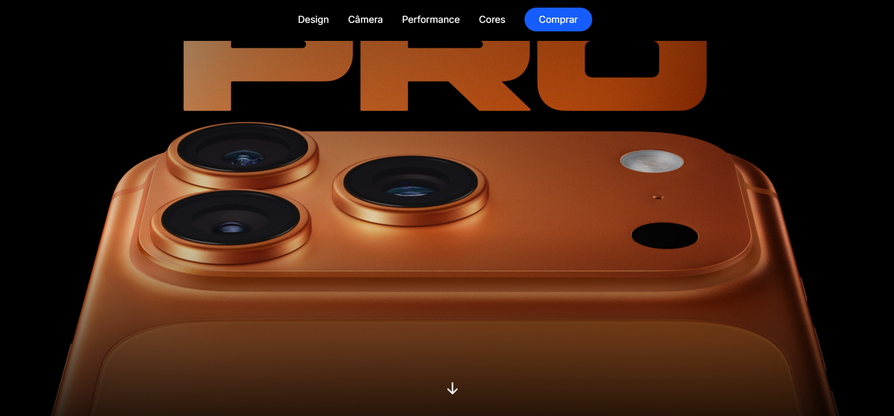
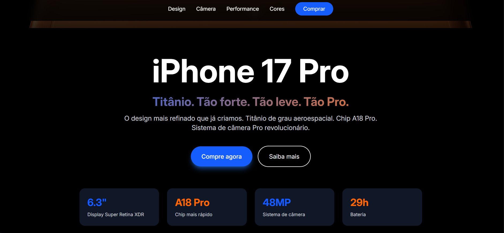
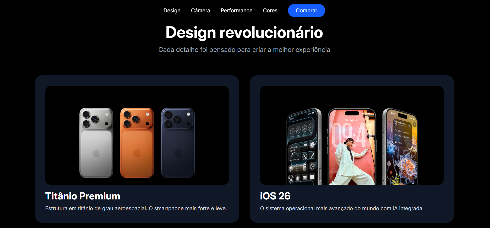

# 📱 iPhone 17 Pro - Landing Page

Landing Page desenvolvida com **React**, **TypeScript** e **Vite**, inspirada no design moderno da Apple.

O projeto foi criado para praticar desenvolvimento frontend, componentização, responsividade e criação de interfaces modernas.

## 🚀 Tecnologias

* React
* TypeScript
* Vite
* CSS3
* Vercel

## 📂 Estrutura do Projeto

```text
src/
├─ assets/
├─ components/
├─ App.tsx
├─ App.css
├─ index.css
└─ main.tsx
```

## ⚙️ Executando Localmente

Clone o repositório:

```bash
git clone https://github.com/CintiaLima-83/iphone-17.git
```

Entre na pasta do projeto:

```bash
cd iphone-17
```

Instale as dependências:

```bash
npm install
```

Execute o projeto:

```bash
npm run dev
```

Acesse no navegador:

```text
http://localhost:5173
```

## 🌐 Deploy

Aplicação disponível em:

https://iphone-17-iota.vercel.app

## 📸 Preview

### Hero Section



### Informações do Produto



### Design



## ✨ Autor

**Cintia Lima**

Desenvolvedora Frontend em formação, com foco em React, TypeScript e Next.js.

Atualmente expandindo conhecimentos em Backend, Cibersegurança, Inteligência Artificial e Inglês.

